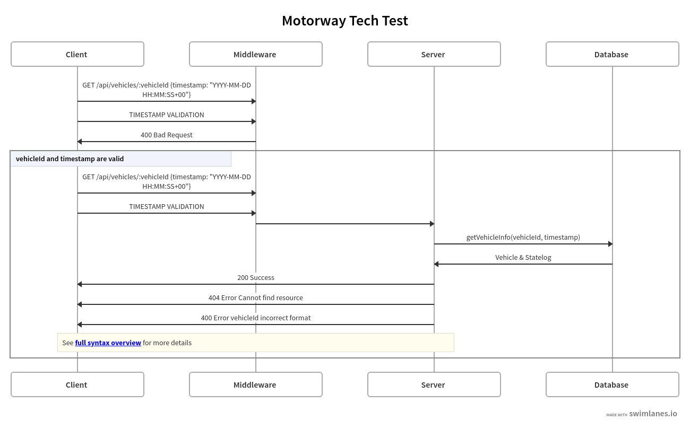
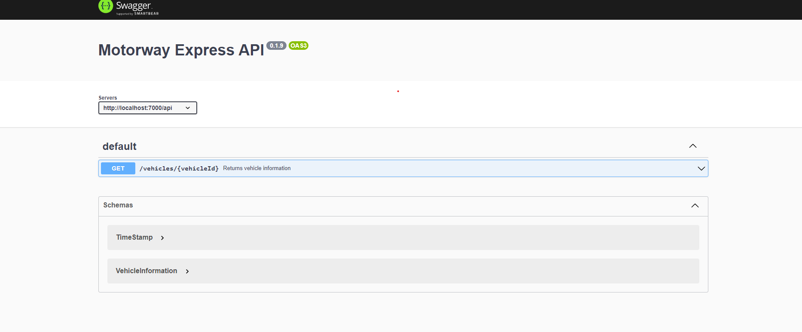

### Aim of the Project
The `vehicles` table has the data of cars that Motorway has sold in the past, or is in the process of selling. The vehicle's current state is defined in the `state` field. The state defines the lifecycle of a vehicle, from quoted to selling and sold.

The `stateLogs` table has the history of each vehicle's state transitions, from the moment it was created with the quoted state, to the most recent state transition.

Your task is to build an API with Node.js that, based on a vehicle id and a timestamp, returns a vehicle's information and the vehicle's state on the given timestamp.

Install requirements:
 - docker (https://docs.docker.com/get-docker/)

To initialize this project, run `docker compose up` from the root of this project. This will build and seed the database. By default the database runs on port `5432` and is also exposed on `5432`, if you want to change this you can update `docker-compose.yml`.

## Setting up the Application
 
1) enter `npm install` to get the dependancies
2) create .env file at the root and enter the following variables

PORT=7000

DB_PORT=5432

HOST=localhost

DB_USER=user 

DB_PASSWORD=password

DB_NAME=motorway

3) enter the command `docker compose up` from the root to spin up the database
4) enter the command `npm run dev` from the root to start the development server
5) to see all the tests that are passing, enter the command `npm run test` from the root of the project

The server will then start on http://localhost:7000

The main endpoint of focus will be http://localhost:7000/api/vehicles/:vehicleId

